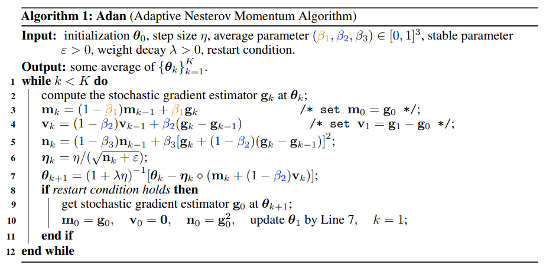

</img>

## Adan - Pytorch

Implementation of the <a href="https://arxiv.org/abs/2208.06677">Adan</a> (ADAptive Nesterov momentum algorithm) Optimizer in Pytorch.

## Install

```bash
$ pip install adan-pytorch
```

## Usage

```python
from adan_pytorch import Adan

# mock model

import torch
from torch import nn

model = torch.nn.Sequential(
    nn.Linear(16, 16),
    nn.GELU()
)

# instantiate Adan with model parameters

optim = Adan(
    model.parameters(),
    lr = 1e-3,                 # learning rate
    betas = (0.1, 0.1, 0.001), # beta 1-2-3 as described in paper
    weight_decay = 0.          # weight decay
)

# train

for _ in range(10):
    loss = model(torch.randn(16)).sum()
    loss.backward()
    optim.step()
    optim.zero_grad()

```

## Citations

```bibtex
@article{Xie2022AdanAN,
    title   = {Adan: Adaptive Nesterov Momentum Algorithm for Faster Optimizing Deep Models},
    author  = {Xingyu Xie and Pan Zhou and Huan Li and Zhouchen Lin and Shuicheng Yan},
    journal = {ArXiv},
    year    = {2022},
    volume  = {abs/2208.06677}
}
```
